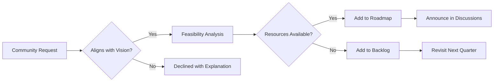

# Prodaric Platform Roadmap

> **Last Updated:** January 15, 2026  
> **Status:** Living Document - Updated Monthly

Welcome to the Prodaric public roadmap! This document outlines our plans for building the future of PropTech. We believe in transparent development and welcome community feedback on our direction.

---

## 🎯 Vision & Strategy

**Mission:** Build the most comprehensive, open-source PropTech platform that empowers real estate professionals worldwide.

**Strategic Pillars:**
1. **Developer-First**: Excellent DX, comprehensive APIs, clear documentation
2. **Modular Architecture**: Deploy what you need, scale as you grow
3. **Community-Driven**: Open-source, transparent, collaborative
4. **Enterprise-Ready**: Security, scalability, compliance from day one

---

## 📅 Release Timeline

### Q1 2026 - FOUNDATION 🏗️
*Building the groundwork for everything that follows*

#### ✅ Completed
- [x] **Organization Setup** - Repository structure, team onboarding
- [x] **Brand Identity** - Name, tagline, visual identity defined
- [x] **Architecture Design** - Technical architecture documented
- [x] **Technology Stack** - .NET 8, React 18, PostgreSQL selected
- [x] **Multi-repository Structure** - Modular codebase architecture

#### 🚧 In Progress
- [ ] **Prodaric Core v0.1** (Target: Jan 31, 2026)
  - Authentication service (OAuth 2.0, JWT)
  - Multi-tenancy foundation
  - Base API infrastructure
  - Database migrations framework
  - Logging and monitoring setup

- [ ] **Documentation Portal** (Target: Feb 15, 2026)
  - Architecture documentation
  - API reference (OpenAPI/Swagger)
  - Getting started guides
  - Development setup tutorials

- [ ] **Developer SDK Alpha** (Target: Feb 28, 2026)
  - .NET SDK for Prodaric APIs
  - TypeScript/JavaScript SDK
  - Python SDK (basic)
  - Code samples and examples

#### 📋 Planned
- [ ] **CI/CD Pipeline** (Target: Mar 15, 2026)
  - Automated testing (unit, integration, e2e)
  - Docker image building
  - Kubernetes deployment automation
  - Staging environment setup

- [ ] **Testing Infrastructure** (Target: Mar 20, 2026)
  - Test data generators
  - Performance benchmarking tools
  - Load testing framework
  - Code coverage > 80%

- [ ] **First Community Contributors** (Target: Mar 31, 2026)
  - Contribution guidelines published
  - Good first issues labeled
  - Code of conduct established
  - Onboard first 10 external contributors

**Key Metrics for Q1:**
- Core API uptime: 99.9%
- Documentation coverage: 100% of public APIs
- Test coverage: > 80%

---

### Q2 2026 - CORE PRODUCTS 🚀
*Launching foundational PropTech modules*

#### 📋 Planned

**April 2026**
- [ ] **Prodaric Lease v0.1 Alpha**
  - Basic lease creation and management
  - Tenant information storage
  - Lease document generation
  - Simple payment tracking
  - CRUD operations API

- [ ] **API Documentation v1.0**
  - Interactive API explorer
  - Code generation tools
  - Postman collections
  - Authentication guides

**May 2026**
- [ ] **Prodaric Invest v0.1 Alpha**
  - Property valuation calculator
  - Basic ROI analysis
  - Cash flow projections
  - Investment comparison tool
  - Market data integration

- [ ] **Beta Testing Program**
  - Recruit 50 beta testers
  - Feedback collection system
  - Bug bounty program launch
  - User experience research

**June 2026**
- [ ] **Developer Experience Improvements**
  - CLI tool for project scaffolding
  - VS Code extension
  - API client libraries v1.0
  - Webhook testing tools

- [ ] **Security Audit**
  - Third-party security assessment
  - Penetration testing
  - OWASP compliance check
  - Vulnerability disclosure program

**Key Deliverables:**
- 2 core products in alpha
- 100+ beta users onboarded
- Security audit completed
- API v1.0 stable release

---

### Q3 2026 - ECOSYSTEM EXPANSION 🌐
*Building the PropTech platform ecosystem*

#### 📋 Planned

**July 2026**
- [ ] **Prodaric Market v0.1 Alpha**
  - Property listing creation
  - Basic search functionality
  - Lead capture forms
  - Photo/document upload
  - Public listing pages

- [ ] **Integration Marketplace**
  - Zapier integration
  - Google Maps integration
  - Stripe payment gateway
  - SendGrid email integration
  - DocuSign e-signatures

**August 2026**
- [ ] **Prodaric Manage v0.1 Alpha**
  - Work order management
  - Vendor database
  - Maintenance scheduling
  - Inspection checklists
  - Asset tracking

- [ ] **Mobile Apps Alpha**
  - React Native codebase
  - iOS app (TestFlight)
  - Android app (Beta)
  - Push notifications
  - Offline capabilities (basic)

**September 2026**
- [ ] **Community Features**
  - Discussion forums
  - Feature voting system
  - Community showcases
  - Partner program launch
  - Contributor leaderboard

- [ ] **Performance Optimization**
  - Database query optimization
  - Caching layer improvements
  - CDN implementation
  - Load testing at 10k concurrent users

**Key Deliverables:**
- 4 total products (2 new)
- Mobile apps in beta
- 5+ third-party integrations
- 1,000+ registered users

---

### Q4 2026 - INTELLIGENCE & SCALE 📊
*Adding AI/ML capabilities and preparing for scale*

#### 📋 Planned

**October 2026**
- [ ] **Prodaric Analytics v0.1 Alpha**
  - Real-time dashboards
  - Custom report builder
  - Data export functionality
  - KPI tracking
  - Portfolio analytics

- [ ] **Machine Learning Foundation**
  - Property price prediction model
  - Market trend analysis
  - Occupancy forecasting
  - Maintenance prediction
  - Tenant risk scoring (fair housing compliant)

**November 2026**
- [ ] **Advanced Reporting Engine**
  - Scheduled reports
  - PDF generation
  - Excel exports
  - Email distribution
  - Custom visualizations

- [ ] **Public API v1.0 Stable**
  - Rate limiting
  - API key management
  - Usage analytics
  - SLA commitments
  - API versioning strategy

**December 2026**
- [ ] **Enterprise Features**
  - SSO integration (SAML, OIDC)
  - Advanced RBAC
  - Audit logging enhancements
  - Custom branding
  - Dedicated support tier

- [ ] **2026 Year-End Release**
  - All 6 core products in beta
  - Production-ready deployment guides
  - Case studies published
  - Community stats report
  - 2027 roadmap announcement

**Key Deliverables:**
- All 6 products launched
- ML models in production
- Public API v1.0 stable
- 5,000+ users
- First enterprise customers

---

### Q1 2027 - SCALE & MATURITY 🚀
*Going production-ready and global*

#### 💭 Future Vision

**Themes:**
- Production v1.0 releases
- International expansion
- Advanced AI capabilities
- White-label platform
- Enterprise focus

**Potential Features:**
- Multi-language support (i18n)
- Regional compliance tools
- Advanced AI agents
- Blockchain integration for smart contracts
- White-label SaaS offering
- Mobile SDK for partners
- Advanced workflow automation
- GraphQL API
- Real-time collaboration features

**Note:** Q1 2027 details will be finalized in Q3 2026 based on community feedback and market validation.

---

## 🗳️ Community Feature Requests

Top-voted features from our community (updated monthly):

| Rank | Feature | Votes | Status | Target |
|------|---------|-------|--------|--------|
| 1 | Mobile apps | 234 | 🚧 In Progress | Q3 2026 |
| 2 | Zapier integration | 187 | 📋 Planned | Q3 2026 |
| 3 | Bulk import tool | 156 | 📋 Planned | Q2 2026 |
| 4 | Customizable workflows | 142 | 💭 Researching | Q4 2026 |
| 5 | Multi-language support | 128 | 💭 Future | Q1 2027 |
| 6 | Advanced reporting | 119 | 📋 Planned | Q4 2026 |
| 7 | Tenant portal | 104 | 💭 Researching | Q4 2026 |
| 8 | Maintenance predictions | 98 | 📋 Planned | Q4 2026 |
| 9 | API rate limit increase | 87 | 💭 Evaluating | TBD |
| 10 | Dark mode | 76 | 📋 Planned | Q3 2026 |

**Want to vote?** Visit [GitHub Discussions](https://github.com/orgs/prodaric/discussions/categories/feature-requests)

**Suggest a feature:** Open a new discussion with the `feature-request` label

---

## 🔧 Technical Debt & Quality Commitments

We're committed to maintaining high code quality alongside feature development:

### Ongoing Commitments
- **Code Coverage**: Maintain > 80% test coverage across all repos
- **Documentation**: Every public API must have complete documentation
- **Performance**: p95 response time < 200ms for all API endpoints
- **Security**: Monthly dependency updates, quarterly security audits
- **Accessibility**: WCAG 2.1 AA compliance for all UI components

### Known Technical Debt (Prioritized)

#### High Priority
- [ ] **Migrate to Entity Framework Core 9** (Q2 2026)
  - Better performance
  - Improved LINQ capabilities
  - Enhanced migrations

- [ ] **Refactor Authentication Service** (Q2 2026)
  - Extract to separate microservice
  - Improve token refresh logic
  - Add biometric support

- [ ] **Database Optimization** (Q3 2026)
  - Query performance analysis
  - Index optimization
  - Connection pooling improvements

#### Medium Priority
- [ ] **Frontend State Management Refactor** (Q3 2026)
  - Consolidate state management
  - Reduce bundle size
  - Improve caching strategy

- [ ] **API Versioning Strategy** (Q3 2026)
  - Implement proper API versioning
  - Deprecation policy
  - Breaking change process

#### Low Priority
- [ ] **Legacy Code Cleanup** (Q4 2026)
  - Remove unused dependencies
  - Refactor monolithic services
  - Update coding standards

---

## 📦 Versioning & Release Strategy

### Semantic Versioning

We follow [Semantic Versioning 2.0.0](https://semver.org/):

- **Major (X.0.0)**: Breaking changes, major features
- **Minor (0.X.0)**: New features, backward-compatible
- **Patch (0.0.X)**: Bug fixes, minor improvements

### Release Cycle

```
┌─────────────┐     ┌─────────────┐     ┌─────────────┐
│   Alpha     │────▶│    Beta     │────▶│   Stable    │
│  (internal) │     │ (public)    │     │ (v1.0+)     │
└─────────────┘     └─────────────┘     └─────────────┘
     2-4 weeks           4-8 weeks          Quarterly

Features under      Feature complete,   Production-ready,
development         testing phase       Long-term support
```

### Release Channels

| Channel | Purpose | Update Frequency | Stability |
|---------|---------|------------------|-----------|
| **Nightly** | Cutting-edge, latest commits | Daily | ⚠️ Experimental |
| **Alpha** | Internal testing, incomplete features | Weekly | ⚠️ Unstable |
| **Beta** | Public testing, feature-complete | Bi-weekly | ⚡ Mostly stable |
| **Stable** | Production use | Monthly | ✅ Reliable |
| **LTS** | Long-term support | Quarterly | ✅ Rock solid |

### Current Versions (as of Jan 2026)

| Product | Current | Next Release | Type |
|---------|---------|--------------|------|
| Prodaric Core | - | v0.1.0 | Alpha |
| Prodaric Lease | - | v0.1.0 | Alpha |
| Prodaric Invest | - | v0.1.0 | Alpha |
| Prodaric Market | - | v0.1.0 | Alpha |
| Prodaric Manage | - | v0.1.0 | Alpha |
| Prodaric Analytics | - | v0.1.0 | Alpha |

### Support Policy

- **Alpha/Beta**: No support commitments, breaking changes possible
- **Stable (v1.x)**: Bug fixes for 6 months after next minor release
- **LTS (v2.0, v3.0)**: Security fixes for 2 years, critical bugs for 1 year

---

## 🤝 Contributing to the Roadmap

### Your Voice Matters

This roadmap is shaped by our community. Here's how you can influence our direction:

#### 1. Vote on Features
- Browse [Feature Requests](https://github.com/orgs/prodaric/discussions/categories/feature-requests)
- React with 👍 to features you want
- Comment with your use case

#### 2. Propose New Features
```markdown
Title: [Feature Request] Your feature name

**Problem Statement**
Describe the problem this solves

**Proposed Solution**
Your suggested implementation

**Alternative Solutions**
Other approaches considered

**Use Cases**
Real-world scenarios

**Impact**
Who benefits and how
```

#### 3. Participate in RFC Process
For major features, we publish **Requests for Comments (RFCs)**:
- Review RFC documents
- Provide technical feedback
- Share implementation concerns
- Suggest alternatives

#### 4. Join Planning Sessions
- **Monthly Roadmap Reviews**: First Monday of each month
- **Community Q&A**: Every other Wednesday
- **Architecture Discussions**: As needed for major changes

#### 5. Contribute Code
Don't just wait - start building!
- Check `good-first-issue` labels
- Join feature development teams
- Submit pull requests

### Roadmap Change Process



### Decision Criteria

Features are evaluated based on:
1. **Alignment**: Does it fit our vision and strategy?
2. **Impact**: How many users benefit?
3. **Effort**: Development complexity and time
4. **Dependencies**: Technical prerequisites
5. **Community**: Level of community demand
6. **Maintenance**: Long-term support burden

**Scoring:** Each criterion rated 1-5, minimum score 20/30 to proceed

---

## 📊 Success Metrics

We measure our progress with these key metrics:

### Product Metrics (Q4 2026 Targets)
- 🎯 **Active Users**: 5,000+ monthly active users
- 🎯 **API Calls**: 1M+ API requests per day
- 🎯 **Properties Managed**: 10,000+ properties on platform
- 🎯 **Uptime**: 99.9% service availability

### Community Metrics (Q4 2026 Targets)
- 🎯 **GitHub Stars**: 1,000+ stars across repos
- 🎯 **Contributors**: 50+ active contributors
- 🎯 **Community Members**: 500+ in discussions/forums
- 🎯 **Integrations**: 10+ third-party integrations

### Quality Metrics (Continuous)
- 🎯 **Test Coverage**: > 80%
- 🎯 **Documentation**: 100% API coverage
- 🎯 **Performance**: p95 < 200ms
- 🎯 **Security**: Zero critical vulnerabilities

---

## 🔄 Roadmap Updates

This roadmap is reviewed and updated:
- **Monthly**: Progress updates, metric tracking
- **Quarterly**: Major revisions, next quarter planning
- **Annually**: Strategic direction, long-term vision

**Last Review:** January 15, 2026  
**Next Review:** February 1, 2026

### Stay Updated

- 📧 **Email Newsletter**: [Subscribe](https://prodaric.com/newsletter) (coming soon)
- 💬 **GitHub Discussions**: [Follow](https://github.com/orgs/prodaric/discussions)
- 🐦 **Twitter**: [@prodaric](https://twitter.com/prodaric) (coming soon)
- 📝 **Blog**: [blog.prodaric.com](https://blog.prodaric.com) (coming soon)

---

## ❓ FAQ

### Can I rely on this roadmap for business planning?
This roadmap represents our current intentions but is subject to change. We recommend staying flexible and following our monthly updates.

### What if a feature gets delayed?
We'll communicate delays transparently with reasoning. Critical features get priority, nice-to-haves may shift.

### Can I sponsor development of a specific feature?
Yes! Contact us at [neftali@coderic.org](mailto:neftali@coderic.org) to discuss sponsorship opportunities.

### How do you decide feature priority?
We balance community votes, strategic alignment, technical dependencies, and resource availability.

### Can I build my own module?
Absolutely! Our modular architecture supports custom modules. See our [Module Development Guide](./docs/module-development.md) (coming soon).

---

## 📝 Changelog

### January 2026
- 🎉 Initial public roadmap published
- ✅ Q1 2026 Foundation phase begun
- 🚧 Core v0.1 development started

---

<div align="center">

### 🚀 Building the Future of PropTech Together

This roadmap is a living document shaped by our community.  
Have questions? Join the conversation in [GitHub Discussions](https://github.com/orgs/prodaric/discussions).

[← Back to README](./README.md) | [Architecture](./docs/ARCHITECTURE.md) | [Contributing](./CONTRIBUTING.md)

---

*Last updated: January 15, 2026 • [View History](https://github.com/prodaric/Prodaric/commits/main/ROADMAP.md)*

</div>
